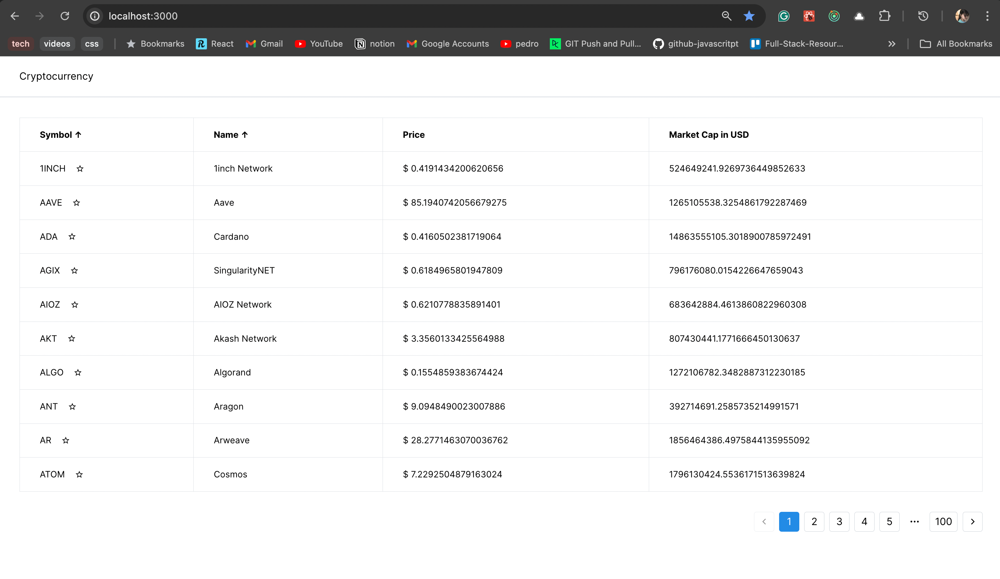
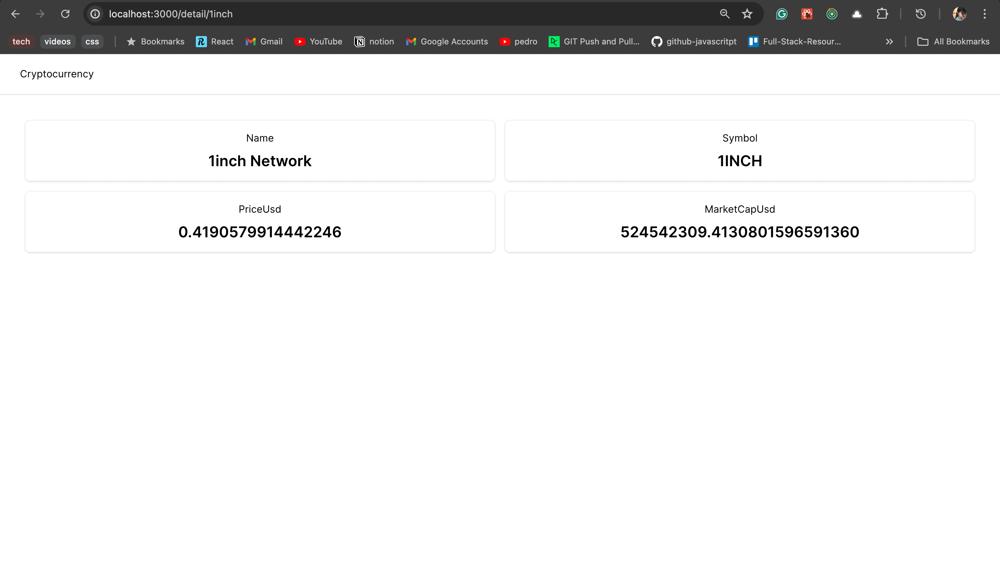

# Cryptocurrency Dashboard

## Overview

This project is a web application that displays real-time cryptocurrency data fetched from the CoinCap API. It consists of two main pages: the Table Page and the Details Page.

### Table Page (First Page)

#### Features:

- **Fetch Real-Time Cryptocurrency Data:**

  - Utilizes the CoinCap API (`https://api.coincap.io/v2/assets`) to fetch real-time cryptocurrency prices.
  - Displays the data in a table with columns for the symbol, name, price, and market cap in USD.
  - Refreshes the data every 10 seconds to ensure up-to-date information.
  - Implements pagination to show 10 items per page.

- **Table Features:**

  - Allows sorting by symbol or name to easily find cryptocurrencies.
  - Ensures that sorting preferences are persistent even when data is refreshed.
  - Clicking on a cryptocurrency name redirects to a detailed page for more information.

- **Favorites Feature:**
  - Includes a "favorite" toggle button for each cryptocurrency, allowing users to mark/unmark favorites. There is a star icon against each symbol. If the star is filled, it depicts that the user marked it as favourite.
  - Stores the favorite list locally using local storage to persist across sessions (page reloads).

### Details Page (Second Page)

#### Features:

- Implements a details page for a selected cryptocurrency (e.g., Bitcoin).
- Fetches detailed information using the CoinCap API with dynamic route parameters (e.g., `https://api.coincap.io/v2/assets/<id>`).
- Displays detailed information including symbol, name, price, and market cap.

### Additional Information

- **Testing Framework:**

  - The project is set up with a testing framework (preferably Jest) to ensure reliability and performance.

  ## Testing Strategy

  The testing approach for the `Detail Page` component focuses on the following key areas:

  1. **Fetch Functionality**: Ensuring the component correctly fetches data from the API.
  2. **Loading State**: Verifying the component displays a loader while data is being fetched.
  3. **Data Rendering**: Checking that the fetched data is correctly rendered in the component.

  ## Test Implementation

  ### Mocking Fetch

  The global fetch function is mocked to control the responses for the API calls. This allows us to simulate different scenarios such as successful fetch, fetch with error, etc.

  ### Mocking Dynamic Imports

  Dynamic imports are mocked to simulate the loading of modules or components that are imported dynamically. This is particularly useful for testing code splitting scenarios or when a component relies on dynamic imports for fetching additional scripts or components at runtime.

  ### Screenshots

  
  

## Getting Started

To get started with this project, clone the repository and install the necessary dependencies. Ensure you have Node.js and npm installed on your system.

```bash
git clone <repository-url>
cd <project-directory>
npm install
npm run dev
```
